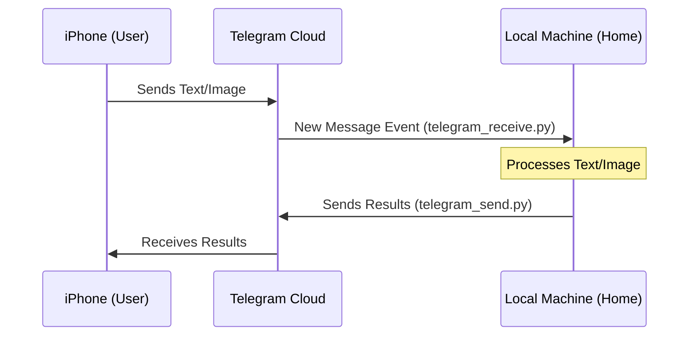

# Telegram Interface

A set of Python scripts for interacting with the Telegram API using the Telethon library.

## Workflow

The following diagram illustrates the interaction between a mobile device and a local machine using these scripts:



## Functionality

- **Message Monitoring**: Logs incoming messages from all active chats in real-time.
- **Media Acquisition**: Downloads received photos to a local directory.
- **Message Dispatch**: Sends text messages and files to specified recipients.
- **Authentication**: Manages Telegram session authorization and configuration via environment variables.

## Requirements

- Python 3.10+
- Telegram API credentials (ID and Hash)

## Operating Costs (macOS)

- **Software**: The Python interpreter and the Telethon library are open-source and available at no cost.
- **Telegram API**: Usage of the Telegram API for personal, non-commercial applications is currently free of charge, subject to standard rate limits.
- **CPU Usage**: The listener script (`telegram_receive.py`) is an asynchronous process. When idling (waiting for new messages), CPU utilization is minimal. Spikes in CPU usage occur during:
  - Network I/O when receiving or sending data.
  - Disk I/O and decryption when downloading media files.
  - Data processing tasks performed on received content.
- **Hardware/Electricity**: Running the listener script requires the local machine to remain active. Electricity consumption is primarily determined by the system's baseline power draw and the duration of active processing cycles.

### Obtaining Telegram API Credentials

1.  Log in to the [Telegram core website](https://my.telegram.org) using your phone number.
2.  Select **API development tools**.
3.  Fill out the form to create a new application. You can use any name and platform (e.g., "LocalInterface" and "Desktop").
4.  After submission, the system will display your `api_id` and `api_hash`.
5.  Copy these values into your local `.env` file.

## Installation

1. Install dependencies:
   ```bash
   pip install -r requirements.txt
   ```

2. Define credentials in a `.env` file:
   ```env
   TELEGRAM_ID=your_api_id
   TELEGRAM_HASH=your_api_hash
   PHONE_NUMBER=your_phone_number
   ```

## Usage

### Receiving Messages
The script displays recent chats and listens for new messages.
```bash
python telegram_receive.py --limit 10 --dir ./downloads
```

### Sending Content
The script transmits text or files.

**Send text to "Saved Messages":**
```bash
python telegram_send.py "Message text"
```

**Send a file with a caption:**
```bash
python telegram_send.py -f path/to/file -m "Caption text"
```

**Send to a specific contact:**
```bash
python telegram_send.py "Message text" --to "+1234567890"
```

## Components

- `telegram_receive.py`: Message listener and media downloader.
- `telegram_send.py`: Command-line interface for sending content.
- `telegram_utils.py`: Shared authentication and configuration logic.
- `requirements.txt`: Project dependencies.
